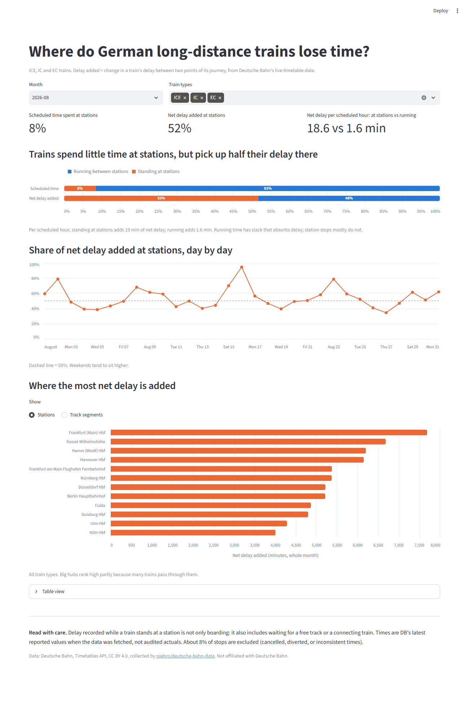

# Where Do German Long-Distance Trains Lose Time?

A SQL-first analysis of Deutsche Bahn punctuality: Python ingestion, DuckDB, dbt models with data
tests, and a Streamlit dashboard.

**Business question:** when an ICE, IC or EC train gets later during its journey, does the delay
build up while it is running between stations or while it is standing at them?



## Finding

**Trains spend about 8% of their scheduled time standing at stations, but that is where about half
of their net delay is added.**

| Month | Scheduled time at stations | Net delay added at stations | Net delay per scheduled hour: stations vs running |
|---|---|---|---|
| June 2026 | 8.7% | 50.9% | 20.3 vs 1.86 min |
| August 2026 | 8.4% | 51.7% | 18.6 vs 1.59 min |

Per scheduled hour, time at stations adds roughly 11 times more net delay than time spent running.
Trains pick up more *gross* delay while running, but win back 59-61% of it through slack in the
running times. At stations only 28-29% is won back.

The result holds across both months and several checks (`uv run python -m analysis.finding`):

- **Outliers do not drive it.** After dropping the 1% most extreme events, the station share rises
  to 68-69%.
- **The daily median is 50-53%.** Single days range from 34% to 94%.
- **Weekends are higher** (60-66%) than weekdays (46-48%).
- **IC trains are the exception**, at 30-34%. ICE trains, which are most of the data, sit at 53-55%.

### Limits of this result

- **"At a station" does not mean "caused by boarding".** Delay recorded while a train stands at a
  station also includes waiting for a free track, waiting for a connecting train, and how DB's
  forecasts split delay between arrival and departure. This analysis says *where* delay is
  recorded, not *why*.
- **Reported times, not audited actuals.** Times are DB's latest reported values when the data was
  fetched (every 6 hours upstream). They are usually, but not always, the final actual times.
- **Coverage.** Two months, long-distance trains only. July 2026 was skipped because 102 hours are
  missing upstream. About 8% of stops are excluded: cancelled stops (their delay is the last
  forecast before cancellation), diversion stops, and stops with impossible times. Heavily
  disrupted journeys are therefore under-represented.
- **Upstream changes.** The source dataset is reprocessed from time to time. The numbers above come
  from revision `d47bd0f7` (see `data/marts/provenance.json`).

## Data

- **Source:** Deutsche Bahn [Timetables API](https://developers.deutschebahn.com/db-api-marketplace/apis/product/timetables),
  as collected by [piebro/deutsche-bahn-data](https://github.com/piebro/deutsche-bahn-data) and
  published on [Hugging Face](https://huggingface.co/datasets/piebro/deutsche-bahn-data) as monthly
  Parquet files.
- **Scope:** ICE, IC and EC stops in June and August 2026: 491,562 stop events and 54,359
  journeys.
- **License:** CC BY 4.0, Deutsche Bahn. The API page also refers to terms of use that restrict
  commercial redistribution without DB's consent. This repo is non-commercial, commits no raw data
  (only aggregates), and credits DB. See [DATA_LICENSE.md](DATA_LICENSE.md).

## How it's built

```
Hugging Face (monthly parquet)
  -> ingest/fetch_months.py     keep ICE/IC/EC rows, pinned to a dataset revision, incremental
  -> DuckDB + dbt
       staging       stg_stop_events        one row per stop, computed delays, quality flags
       intermediate  int_usable_stops       drop cancelled / diverted / implausible stops
                     int_journey_legs       delay added between consecutive stops (running)
                     int_station_dwells     delay added while standing at a stop
       marts         fct_delay_by_phase     running vs at-station, per day and train type
                     fct_delay_locations    per station and per directed track segment
  -> analysis/export_marts.py   small parquet files in data/marts/ (committed)
  -> app/streamlit_app.py       dashboard
```

A journey is one run of one train on one day. It is identified by the ride id plus the first
planned departure encoded in the stop id. Delay is split into two parts:

- **running:** arrival delay at stop *n* minus departure delay at stop *n-1*
- **at station:** departure delay minus arrival delay at the same stop

Legs across a skipped or unusable stop are dropped, so delay is never attributed across a gap.

**45 dbt data tests** run on every build:

- `unique`, `not_null`, `accepted_values`, `relationships`, and `dbt_utils` range and
  combination checks
- Singular tests:
  - our computed delay equals the source's `delay_in_min` for every row
  - for every complete journey, first departure delay + running + at-station additions equals the
    final arrival delay exactly
  - both marts reconcile to the same monthly totals
  - fewer than 1% of stops have implausible times, which guards against upstream changes

**Automation:** `ci.yml` runs lint and pytest on every push. `monthly.yml` runs on the 5th of each
month: it adds the newest month, rebuilds, runs all data tests, and commits the refreshed marts
only if everything passes.

## Reproduce it

Requires [uv](https://docs.astral.sh/uv/). All commands run from the repo root.

```bash
uv sync
uv run python -m ingest.fetch_months --months 2026-06 2026-08   # ~40 s, ~15 MB after filtering
uv run dbt deps  --project-dir dbt --profiles-dir dbt
uv run dbt build --project-dir dbt --profiles-dir dbt           # models + 45 data tests
uv run python -m analysis.finding                                # numbers in this README
uv run python -m analysis.export_marts
uv run streamlit run app/streamlit_app.py
uv run pytest                                                    # 10 tests
```

The dashboard only needs the committed files in `data/marts/`, so `uv sync` followed by the
Streamlit command is enough to open it.

## What a client could use this for

- **Rail operators and transport authorities:** a monthly, tested view of where delay builds up,
  by station and by direction of track. It is a starting point for deciding where to look at
  platform processes, dwell times or timetable slack. It is not a root-cause diagnosis.
- **Consultancies and analysts:** a reproducible template (ingest -> dbt -> tests -> dashboard) for
  any stop-level punctuality feed. Another operator's data only needs a new staging model.
- **Reporting:** the automated data tests flag upstream changes before they reach a chart.

## License

Code: MIT, see [LICENSE](LICENSE). Data: CC BY 4.0, Deutsche Bahn; see
[DATA_LICENSE.md](DATA_LICENSE.md). Not affiliated with Deutsche Bahn.
